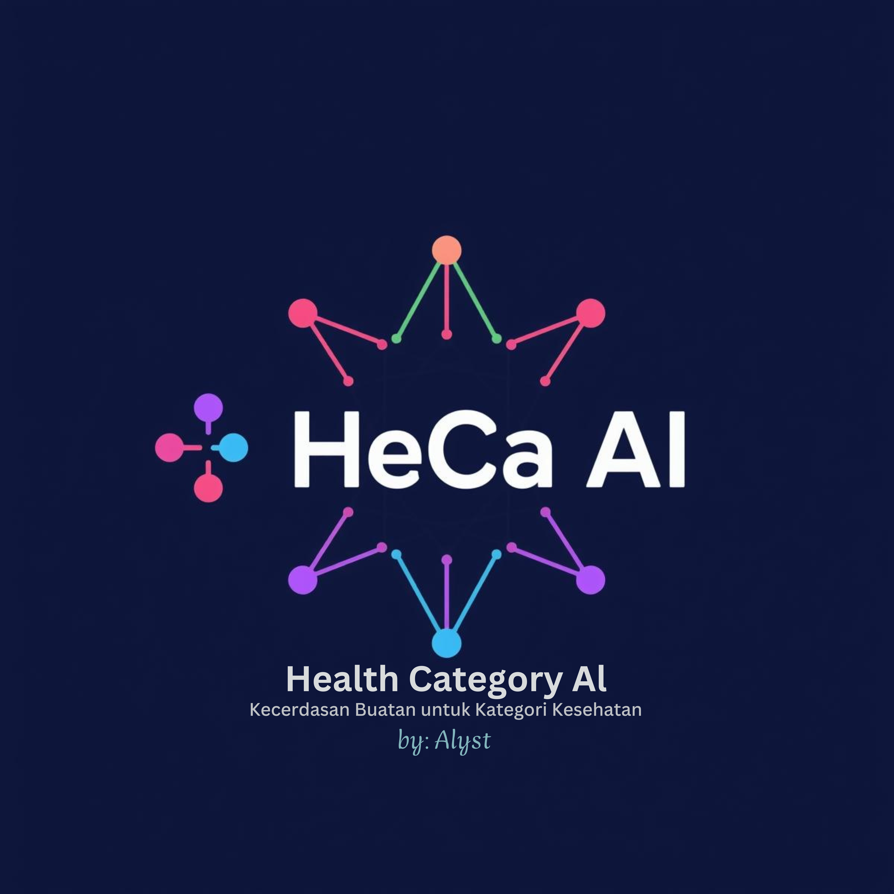

<div align="center">



# HeCa AI : Health Category AI

**Klasifikasi keluhan kesehatan berbahasa Indonesia dengan AI yang transparan dan jujur secara statistik.**

Menggabungkan **LMPNN (k=9)** dan **Split Conformal Prediction** untuk memetakan keluhan ke **107 kategori medis**, lengkap dengan ukuran kepercayaan yang dapat dipertanggungjawabkan.

[](https://nextjs.org/)
[](https://laravel.com/)
[](https://fastapi.tiangolo.com/)
[](https://www.postgresql.org/)
[](https://www.python.org/)

</div>

---

## Daftar Isi

- [Tentang Proyek](#tentang-proyek)
- [Fitur Utama](#fitur-utama)
- [Arsitektur Sistem](#arsitektur-sistem)
- [Struktur Folder](#struktur-folder)
- [Cara Cepat dengan Docker](#cara-cepat-dengan-docker)
- [Menjalankan Manual](#menjalankan-manual)
- [File Model](#file-model)
- [Database](#database)
- [Kontrak API](#kontrak-api)
- [Deployment](#deployment)
- [Hasil Evaluasi](#hasil-evaluasi)
- [Disclaimer](#disclaimer)

---

## Tentang Proyek

**HeCa AI (Health Category AI)** adalah aplikasi web yang mengklasifikasikan keluhan kesehatan berbahasa Indonesia ke dalam 107 kategori medis. Berbeda dengan model kotak hitam, HeCa AI dirancang sebagai contoh **Explainable AI** di bidang kesehatan: setiap prediksi disertai tingkat kredibilitas dan keyakinan yang valid secara statistik melalui Conformal Prediction.

> Berbasis skripsi *Alif Gumelar Syah Moeslim (Alyst)* : "Klasifikasi Teks Kesehatan Indonesia dengan LMPNN dan Conformal Prediction".

---

## Fitur Utama

- **Klasifikasi 107 kategori medis** dari teks keluhan bahasa Indonesia.
- **LMPNN (Local Mean Pseudo Nearest Neighbor)** k=9 yang transparan dan dapat ditelusuri.
- **Split Conformal Prediction** yang memberi prediction set dengan jaminan cakupan.
- **Meter kredibilitas dan keyakinan** yang mudah dipahami orang awam.
- **Visualisasi tetangga KNN** untuk menjelaskan dasar setiap prediksi.
- **UI ber-estetika Apple / Glass** : sudut membulat, efek kaca buram, mode gelap, dan animasi halus.
- **Dokumentasi interaktif** : laci pop-up berisi perjalanan penelitian, keilmuan algoritma, dan daftar 107 kategori.

---

## Arsitektur Sistem

HeCa AI memakai arsitektur tiga lapis (3-tier):

```
   Browser
      |
      v  HTTP (JSON)
+--------------+      +----------------+      +-------------------+
|  Frontend    | ---> |  Backend API   | ---> |  ML Service       |
|  Next.js     |      |  Laravel       |      |  FastAPI (Python) |
|  (Vercel)    | <--- |  + PostgreSQL  | <--- |  LMPNN + CP       |
+--------------+      +----------------+      +-------------------+
   :3000               :8000  /api            :8001
```

**Mengapa ML Service dipisah?** Model dilatih sepenuhnya di Python (scikit-learn, Sastrawi, numpy). Laravel berjalan di PHP dan tidak bisa menjalankan model itu secara native. Maka model disajikan sebagai microservice FastAPI; Laravel berperan sebagai API gateway (validasi, simpan riwayat ke PostgreSQL, proxy) dan Next.js sebagai antarmuka pengguna.

---

## Struktur Folder

```
heca-ai/
|- ml-service/     # FastAPI : inferensi LMPNN + Conformal Prediction
|- backend/        # Laravel : API gateway + PostgreSQL (riwayat)
|- frontend/       # Next.js : UI Apple/Glass + chat + visualisasi KNN/CP
|- docker-compose.yml
```

---

## Cara Cepat dengan Docker

```bash
# 1) Letakkan file model di ml-service/models/ (lihat bagian File Model)

# 2) Generate APP_KEY Laravel sekali:
docker run --rm php:8.2-cli php -r "echo 'base64:'.base64_encode(random_bytes(32)).PHP_EOL;"

# 3) Buat file .env dari template, lalu isi APP_KEY hasil di atas
cp .env.example .env

# 4) Jalankan semuanya
docker compose up --build
```

Akses aplikasi di **http://localhost:3000**

---

## Menjalankan Manual

Butuh tiga terminal terpisah.

### Terminal 1 : ML Service (Python)

```bash
cd ml-service
python -m venv .venv
source .venv/bin/activate        # Windows: .venv\Scripts\activate
pip install -r requirements.txt
uvicorn main:app --reload --port 8001
```

Cek kesehatan: http://localhost:8001/health

### Terminal 2 : Backend (Laravel)

Prasyarat: PHP 8.2+, Composer, dan PostgreSQL berjalan dengan database `heca`.

```bash
cd backend
composer install
cp .env.example .env
php artisan key:generate
php artisan migrate
php artisan serve --port=8000
```

Cek kesehatan: http://localhost:8000/api/health

### Terminal 3 : Frontend (Next.js)

```bash
cd frontend
npm install
cp .env.local.example .env.local
npm run dev
```

Buka aplikasi: http://localhost:3000

---

## File Model

Salin artefak hasil training dari notebook ke folder `ml-service/models/`:

| File | Isi |
|------|-----|
| `hea_model.pkl` | objek `LMPNNFast` hasil fit (k=9) |
| `hea_vectorizer.pkl` | `TfidfVectorizer` (5000 fitur, n-gram 1-2) |
| `hea_label_encoder.pkl` | `LabelEncoder` (107 kelas) |
| `hea_calibration.pkl` | array nonconformity scores kalibrasi |

Kelas `LMPNNFast` sudah direplikasi di `ml-service/inference.py` agar `hea_model.pkl` dapat dimuat tanpa dependensi notebook.

---

## Database

Buat database dan user PostgreSQL (sesuaikan dengan `.env`):

```sql
CREATE DATABASE heca;
CREATE USER heca WITH PASSWORD 'secret';
GRANT ALL PRIVILEGES ON DATABASE heca TO heca;
```

Tabel `consultations` dibuat otomatis lewat `php artisan migrate` dan menyimpan tiap analisis (input, prediksi, credibility, confidence, prediction set, dan top-15 p-value).

---

## Kontrak API

| Method | Endpoint | Keterangan |
|--------|----------|-----------|
| `POST` | `/api/consultations` | `{ text, epsilon, session_id }` lalu prediksi dan simpan |
| `GET`  | `/api/consultations` | riwayat (filter `?session_id=`) |
| `GET`  | `/api/classes` | daftar 107 kelas medis |
| `GET`  | `/api/health` | status backend dan ml-service |

Contoh respons `POST /api/consultations` (bagian `data`):

```json
{
  "prediction": "Sakit Kepala",
  "credibility": 0.82,
  "confidence": 0.74,
  "credibility_level": "Sangat Yakin",
  "credibility_color": "green",
  "prediction_set": ["Sakit Kepala", "Migrain"],
  "epsilon": 0.1,
  "top_classes": ["..."],
  "top_pvalues": [0.82, 0.31],
  "top_similarity": [0.61, 0.40]
}
```

---

## Deployment

- **Frontend ke Vercel.** Import folder `frontend/`, set env `NEXT_PUBLIC_API_URL` ke URL backend publik.
- **Backend + ML Service + PostgreSQL ke VPS atau Cloud via Docker.** Jalankan `docker compose up -d` di server, lalu arahkan domain/HTTPS (mis. Nginx atau Caddy) ke port 8000.
- Pastikan `FRONTEND_URL` di backend menunjuk domain Vercel agar CORS lolos.

---

## Hasil Evaluasi

Dihitung pada 16.213 sampel data uji, 107 kelas, model LMPNN k=9.

| Metrik | Nilai |
|--------|-------|
| Accuracy | 44,75% |
| F1 Macro | 45,48% |
| F1 Weighted | 44,83% |
| Precision Macro | 45,69% |
| Recall Macro | 48,63% |
| F1 Cross Validation (k=9) | 45,74% |
| Mean Credibility | 60,93% |
| Mean Confidence | 55,23% |
| Expected Calibration Error | 0,221 |

**Coverage Conformal Prediction** (terbukti dekat dengan target):

| Epsilon | Target | Tercapai |
|---------|--------|----------|
| 0,05 | 95% | 94,9% |
| 0,10 | 90% | 89,6% |
| 0,20 | 80% | 79,0% |

Akurasi terlihat moderat karena tugas ini sangat menantang, yaitu membedakan 107 kelas yang banyak di antaranya bertumpang tindih secara makna. Di sinilah Conformal Prediction berperan menjaga keandalan melalui prediction set.

---

## Disclaimer

HeCa AI adalah alat bantu klasifikasi teks, **bukan** pengganti diagnosis dokter. Untuk keluhan serius, selalu konsultasikan dengan tenaga medis profesional.

---

<div align="center">

Dibuat oleh **Alif Gumelar Syah Moeslim (Alyst)** : Informatics, UNSAP : NLP dan XAI enthusiast.

</div>
